# duhanbasboga.github.io
# 🚀 Profesyonel Portfolyo

  
  
<i>Yapay zeka destekli otonom sistemler ve veri analitiği çözümleri.</i>

### 🛠️ Sistem Mimarisi

```mermaid
graph LR
    A[Haber Kaynakları] --> B{Python Script}
    B --> C[Gemini AI Analiz]
    C --> D[PDF Oluşturma]
    D --> E[E-posta Gönderimi]
    style B fill:#f9f,stroke:#333,stroke-width:2px
```

## ⚙️ Mekanik Tasarım: Redüktör (3D)

  <iframe title="Redüktör_sldasm" width="800" height="450" 
    src="https://sketchfab.com/models/6b926f0166ca47b59d7cc9255300fc5a/embed?autostart=1&ui_theme=dark" 
    frameborder="0" allowfullscreen mozallowfullscreen="true" webkitallowfullscreen="true" 
    allow="autoplay; fullscreen; xr-spatial-tracking">
  </iframe>
  
<i>Modeli mouse ile döndürebilir, detayları incelemek için yakınlaştırabilirsiniz.</i>

